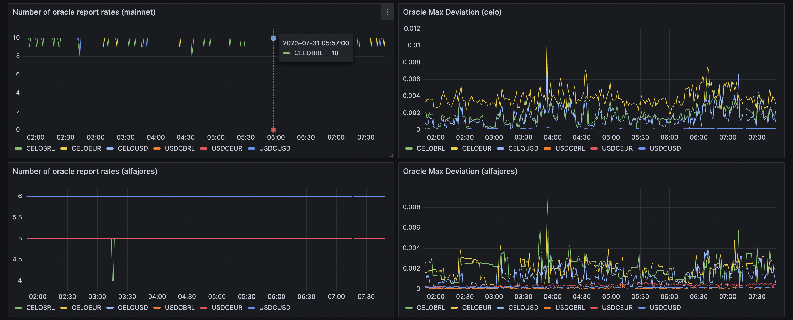

# Aegis

> The modern concept of doing something "under someone's aegis" means doing something under the protection of a powerful, knowledgeable, or benevolent source. The word Aegis is identified with protection by a strong force rooted in Greek mythology and adopted by the Romans.

- [Configuration](#configuration)
  - [Global Config](#global-config)
  - [Chain-specific Config](#chain-specific-config)
  - [Metrics Config](#metrics-config)
    - [Full Metrics Example](#full-metrics-example)
- [Running the app](#running-the-app)
- [Checking the Logs](#checking-the-logs)
- [Grafana Dashboard](#grafana-dashboard)
- [Test](#test)
- [Adding a new Metric](#adding-a-new-metric)
- [Stay in touch](#stay-in-touch)
- [Deployment](#deployment)

Aegis is a monitoring tool that exposes the result of on-chain view calls as Prometheus metrics that get ingested into Grafana.
The system's ethos is that it should be generic and agnostic when it comes to business logic.

It allows you to turn a `config.yaml` like this:

```yaml
# config.yaml
source: SortedOracles.numRates(address rateFeed)(uint256)
schedule: 0/10 * * * * *
type: gauge
chains: all
variants:
  - ['CELOUSD']
  - ['CELOEUR']
  - ['CELOBRL']
  - ['USDCUSD']
  - ['USDCEUR']
  - ['USDCBRL']
```

Into a Grafana Dashboard like this:



## Configuration

The `config.yaml` has three immediate children:

```typescript
interface Config {
  global: Global; // Global definitions
  chains: Chain[]; // Chain definitions
  metrics: Metric[]; // Metric definitions
}
```

### Global Config

The `global` section hosts variables that can be referenced in the `metrics` section as arguments passed to view calls. Global variables can also be extended or overridden by `chain '-specific variables.

```typescript
interface Global {
  vars: Record<string, string>;
}
```

### Chain-specific Config

The `chain` section is an array of chain-specific settings:

```typescript
interface Chain {
  id: string;
  label: string;
  httpRpcUrl: string;
  contracts: Record<string, string>;
  vars: Record<string, string>;
}
```

- If the chain `id` matches an import from [viem's supported chains](https://github.com/wevm/viem/blob/main/src/chains/index.ts), we will use that import, enabling multicall and other goodness (for example, `celoAlfajores` or `celo`).
  However, arbitrary values also work, and Aegis will create a custom chain instance in that case.
- `label` will be used for segmenting in the context of Prometheus metrics `chain={label}`.
- `contracts` should list addresses for all contracts referenced in `metrics`.
- `vars` can contain chain-specific variables to extend or override entries in the `global.vars` object.

### Metrics Config

`Metric` defines a metric with all its possible variations.

```typescript
interface Metric {
  source: string;
  schedule: string;
  type: 'gouge';
  chains: 'all' | string[];
  variants: string[][];
}
```

- The `source` for a metric is the view call used in string format of:

  ```sol
  Contract.function(inputType inputName)(outputType)
  ```

  For example:

  ```sol
  SortedOracles.numRates(address rateFeed)(uint256)
  ```

  The contract name must be defined in the `chains[id].contracts` configs that the metric targets.

  The system currently supports various view call types, such as:

  - `SortedOracles.numRates(address rateFeed)(uint256)`: A single `uint256` value which must not exceed `Number.MAX_SAFE_INTEGER`.
  - `CELOToken.balanceOf(address owner)(uint256)`: A single `uint256` value, divided by 1e18 which must not exceed `Number.MAX_SAFE_INTEGER`.
  - `OracleHelper.deviation(address rateFeed)(uint256,uint256)`: Two `uint256`: value and scale. The metric exposed is then `value/scale`, which must also fit into a `Number`. The conversion will keep 1e6 of precision.

  See the [Adding a new Metric section](#adding-a-new-metric) to learn how to add new view calls to Aegis.

- `schedule` is a cron schedule definition.
- `type` can currently be only `gauge`.
- `chains` can be `all` or an array of chain IDs to which this metric will apply.
- `variants` is a list where each item is an array of arguments passed to the view call.

#### Full Metrics Example

```yaml
source: SortedOracles.numRates(address rateFeed)(uint256)
schedule: 0/10 * * * * *
type: gauge
chains: all
variants:
  - ['CELOUSD']
  - ['CELOEUR']
  - ['CELOBRL']
  - ['USDCUSD']
  - ['USDCEUR']
  - ['USDCBRL']
```

The `variants` are where the `vars` from the `global` and `chain` configs come into play.
Here, we're calling the function six times and, each time, passing the value of the variant variables as the `rateFeed` argument to the view call.

All arguments of the view call will also be passed as metric labels to Prometheus.
Thus, each metric will result in `number of variants * number of chains` values recorded.

An example of the Prometheus endpoint result:

```text
numRates{rateFeed="CELOBRL",chain="celo"} 10
numRates{rateFeed="CELOEUR",chain="celo"} 10
numRates{rateFeed="CELOUSD",chain="celo"} 10
numRates{rateFeed="USDCBRL",chain="celo"} 0
numRates{rateFeed="USDCEUR",chain="celo"} 0
numRates{rateFeed="USDCUSD",chain="celo"} 10
numRates{rateFeed="CELOBRL",chain="alfajores"} 5
numRates{rateFeed="CELOEUR",chain="alfajores"} 5
numRates{rateFeed="CELOUSD",chain="alfajores"} 5
numRates{rateFeed="USDCBRL",chain="alfajores"} 5
numRates{rateFeed="USDCEUR",chain="alfajores"} 5
numRates{rateFeed="USDCUSD",chain="alfajores"} 6
```

## Running the app

```bash
# install dependencies
pnpm install

# run a dev server
pnpm run start

# run a dev server with hot reload
pnpm run start:dev

# run in prod mode
pnpm run start:prod
```

## Checking the Logs

```bash
# Tails the logs of the prod aegis app
pnpm run logs
```

## Grafana Dashboard

```bash
# Opens the Aegis Grafana Dashboard in your default browser
pnpm run grafana
```

We are using Terraform to deploy a Grafana Dashboard containing visualizations for all configured metrics.

To update the dashboard, you simply make the desired changes in [grafana-dashboard.tf](./terraform/grafana-dashboard.tf) and then run `cd terraform && terraform apply` to deploy them.

## Test

```bash
# unit tests
pnpm run test

# e2e tests
pnpm run test:e2e

# test coverage
pnpm run test:cov
```

## Deployment

There are three main components you have to think about:

1. The `aegis` service that polls view calls and exposes Prometheus metrics based on a `config.yaml` file.
2. A service that ingests the metrics, this could be:
   a. A `grafana-agent` instance which pushes the metrics to grafana-cloud.
   b. A Prometheus server that ingests the metrics.
3. (Optional) Helper smart contracts, which do any transformations needed to on-chain data for ingestion by `aegis.`

Deploying `aegis` is done simply by running `npm run deploy`.

To deploy the `grafana-agent,` follow the instructions in `grafana-agent/README.md. '

## Adding a new Metric

1. Add the contract you want to run a view call on to the `chains[id].contracts` section in both `config.local.yaml` and `config.yaml` and make sure to add the correct address for each chain
1. Add your new view call to the bottom of the `metrics` section
   1. If your view call needs any input parameters, make sure to define these either in `global.vars` or `chains[id].vars`, and reference them as `variants` in your metric
1. Extend the `switch` statement in the [Metric.parse()](./src/metric.ts) function with the appropriate logic for your view call's function name.
   1. If you already see another `case` for an existing view call using the same logic (i.e. another call returning a simple `uint256`), you can add the function name of your view call to that `case`
   1. If your view call requires new or adjusted logic, add a new `case` for your function name with the appropriate logic
1. Try out your changes locally by running `npm run dev` and see if the logs output the values you expect
1. If everything works locally, deploy your changes via `npm run deploy`
1. After successful deployment, check if everything works as expected by monitoring the logs via `npm run logs`
1. Create a new Grafana visualization consuming your newly added metric
   1. If you're not a Grafana expert, the easiest would be to create a new empty dashboard and manually compose your query via the UI. You can also take inspiration from viewing the configuration of existing queries on other dashboards.
1. Export your new Grafana visualization to Terraform format
   1. After you're happy with your manually created query, it's time to convert it to Terraform so we can manage all our Grafana config as code and under version control. Your manually created query should offer an **Export** option somewhere on the top right.
   1. From there, it should have the option to export as `JSON`, `YAML`, or `Terraform (HCL)` — pick **Terraform (HCL)**
1. Add your export to [./terraform/grafana-dashboard.tf] to the appropriate section
   1. Finding the right place can be a bit annoying as the exported config is quite verbose. AI is your friend here. You can copy/paste the existing `grafana-dashboard.tf` into your LLM of choice and then ask it to insert your newly exported visualization into the right place.
1. Deploy your new Grafana visualization into the main Aegis dashboard via `cd terraform && terraform apply`
1. Ensure that it worked by reviewing the main Aegis dashboard in Grafana
1. If anything went wrong, roll back your changes to `grafana-dashboard.tf` and keep editing until you get it right :)

## Stay in touch

- Author - [Mento Labs](https://mentolabs.xyz)
- Twitter - [@mentolabs](https://twitter.com/mentolabs)
